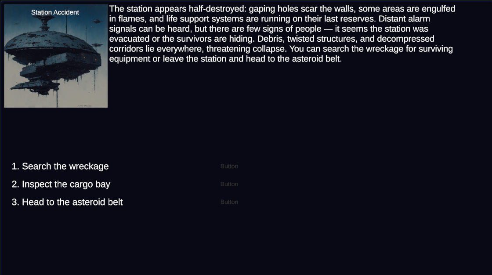
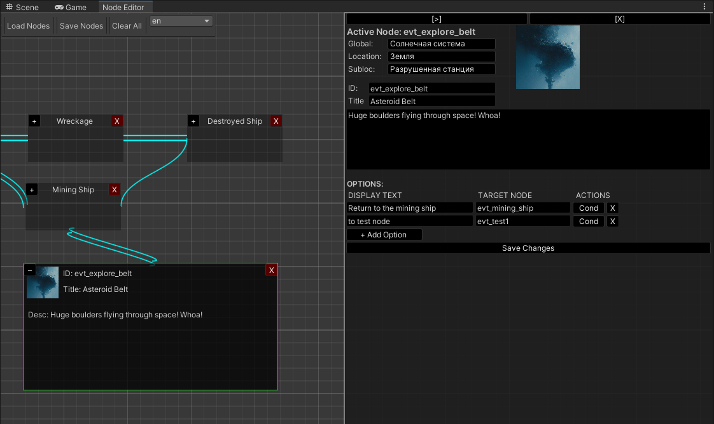

**🌐 Available in: [🇬🇧 English](#english-version) | [🇷🇺 Русский](#русская-версия) | [🇯🇵 日本語](#日本語バージョン)**

### English Version

> ⚠️ **Project is under active development**

Unity Version Control is used as the primary versioning system, so the GitHub version might differ from the latest internal one.  
If needed, temporary access to UVC can be granted — contact by email.

---

## 🛰️ Description

This project is inspired by games like **The Life and Suffering of Sir Brante**, the event systems of **The Crust** and **Ixion**, and the text quests of the **Space Rangers** series.

Gameplay is narrative-driven: the player sees a description and an image of an event, then chooses from 1 to 6 options. Each choice can affect player parameters (attributes, money, reputation, etc.) and lead to a different next event. Some options may be locked unless certain conditions are met.

### 🌌 Story Premise

Set during a period of active space colonization.  
At the start of the game, the player selects a background story, which influences future choices — unlocking or locking certain options.  
The events unfold within the Solar System, both on partially colonized planets (outposts) and in space.

---

## 🛠️ Editor

Since both events and localized strings are stored in JSON files and events are structured as interconnected nodes, the project is currently focused on developing a convenient visual editor for content creation.

---

## 🎥 Video Demo

[[Video link goes here](https://youtu.be/syBOmy79DQo)]

---

## ✅ Implemented Features

- 🌐 Localization system (EN / RU / JP) for both the game and editor
- 🧩 Visual event editor:
  - Node-based layout with connection lines
  - Two view modes: **compact** and **detailed**
  - Create, edit, and save event files and localization strings
  - Switch active language in the editor
  - Create links between events
  - Add conditional requirements to options
  - Choose a display image for each event

---

## 🚧 Priority Development

- [Editor] Improve condition editing UI for event options
- [Editor] Automatically remove unused strings from localization files
- Implement the main menu
- Save/load system for player progress
- Background story selection
- First story chapter content
- Generate new event art via Midjourney

Project Size
Game code: ~800 lines
Event editor code: ~2000 lines
---

### Русская версия

> ⚠️ **Проект находится в активной разработке**

В основном используется **Unity Version Control**, поэтому версия на GitHub может отличаться от актуальной. При необходимости можно выдать временное приглашение — обращаться по почте.

Игра вдохновлена **The Life and Suffering of Sir Brante**, **The Crust**, **Ixion** и текстовыми квестами из **Space Rangers**.

Игровая механика: игроку показывается описание и изображение события, а также от 1 до 6 вариантов выбора. В зависимости от выбора изменяются параметры (атрибуты, деньги, репутация и т.д.) и происходит переход к следующему событию. Некоторые опции могут требовать выполнения условий.

### Сюжет:

Эпоха активного освоения космоса. Игрок выбирает одну из предысторий, влияющую на дальнейшие события. Действие разворачивается в пределах **Солнечной системы** — на частично колонизированных планетах и в космосе.

### Редактор:

Поскольку события и локализации хранятся в JSON и организованы как связанные узлы, разработка сосредоточена на удобном редакторе для создания контента.

### Реализовано:

- Локализация (en / ru / jp) как в игре, так и в редакторе
- Визуальный редактор событий:
  - Узлы и связи между ними
  - Два режима отображения
  - Создание и сохранение событий и строк локализации
  - Переключение языка
  - Условия для опций
  - Выбор изображения события

### В приоритете:

- Улучшение окна редактирования условий
- Очистка локализаций от неиспользуемых строк
- Главное меню
- Сохранение/загрузка прогресса
- Выбор предыстории
- Глава 1
- Рендеринг новых картинок через Midjourney

Текущий размер проекта
Код игры — около 800 строк
Код редактора событий — около 2000 строк
---

### 日本語バージョン

> ⚠️ **現在アクティブに開発中のプロジェクトです**

メインのバージョン管理には **Unity Version Control** を使用しており、GitHub のバージョンは最新ではない可能性があります。必要に応じて一時的な招待リンクを提供できます。詳細はメールでご連絡ください。

このプロジェクトは、**The Life and Suffering of Sir Brante**、**The Crust**、**Ixion** のイベントシステム、および **スペースレンジャー** のテキストクエストからインスピレーションを得ています。

### ゲームの概要：

プレイヤーはイベントの説明と画像を見て、1〜6の選択肢から選びます。選択に応じてパラメータ（属性、資金、評判など）が変化し、次のイベントへと進みます。一部の選択肢は条件を満たす必要があります。

### ストーリー概要：

舞台は宇宙開発が進む **太陽系**。  
プレイヤーは開始時に背景ストーリーを選び、それによって以後の選択に影響を与えます。イベントは前哨基地や宇宙空間で展開されます。

### エディタ：

イベントやローカライズ文字列は JSON 形式で保存され、ノードとして構成されるため、まずは使いやすいビジュアルエディタの構築に注力しています。

### 実装済み：

- ゲームとエディタでの多言語対応（英語、ロシア語、日本語）
- イベントをノードで表示し、接続・編集が可能
- 表示モード切り替え（シンプル／詳細）
- イベントや翻訳の作成と保存
- 言語切り替え機能
- 選択肢の条件設定
- イベント画像の選択

### 今後の予定：

- 条件編集ウィンドウの改善
- 未使用の翻訳文字列の削除
- メインメニューの実装
- セーブ/ロード機能
- 背景ストーリー選択
- 第一章のシナリオ
- Midjourney を使ったイベント画像の作成

現在のプロジェクト規模
ゲーム部分のコード：約 800行

イベントエディタのコード：約 2000行
